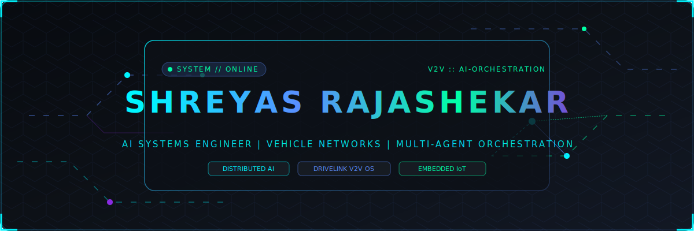

<div align="center">

<!-- HERO BANNER SVG -->


<br/>

<!-- ANIMATED TYPING HEADER -->
<a href="https://github.com/shreyasrajshekar">
  
</a>

<br/>

<!-- QUICK NAVIGATION BADGES -->
<p align="center">
  <a href="https://github.com/shreyasrajshekar"></a>
  <a href="https://github.com/shreyasrajshekar"></a>
  <a href="https://www.linkedin.com/in/shreyas-rajashekar-me/"></a>
  <a href="https://leetcode.com/u/shreyasrajshekar/"></a>
  <a href="mailto:shreyasrajashekar@gmail.com"></a>
  <a href="#-about-me"></a>
  <a href="https://twitter.com"></a>
</p>


</div>

<!-- SYSTEM STATUS & MISSION CONTROL -->
<div align="center">

### 🛸 MISSION CONTROL & SYSTEM STATUS

</div>

<table align="center" width="100%">
  <tr>
    <td width="50%" valign="top">
      <div align="left">

#### ⚙️ LIVE TELEMETRY
- **Current Mission:** Building DriveLink V2V Communication OS
- **Research Vector:** Multi-Agent AI Orchestration & Distributed Intelligence
- **Core Stack:** TypeScript, Python, C++, Node.js, Arduino, Rust
- **Hardware Lab:** ESP32, CAN Bus, Microcontrollers, Robotics

      </div>
    </td>
    <td width="50%" valign="top">
      <div align="left">

#### 🟢 SYSTEM STATUS
- `[STATUS]` 🟢 **Building:** DriveLink OS & Chowki AI
- `[STATUS]` 🟢 **Learning:** Distributed AI & Rust Embedded
- `[STATUS]` 🟢 **Open Source:** Active Contributor
- `[STATUS]` 🟢 **Availability:** Open for Collaborations

      </div>
    </td>
  </tr>
</table>

<br/>

<!-- TERMINAL ABOUT ME -->
<div align="center">
  
</div>

## 💻 SYSTEM // WHOAMI

```bash
$ whoami --verbose

┌────────────────────────────────────────────────────────────────────────────────────────┐
│  USER          : Shreyas Rajashekar                                                    │
│  DEGREE        : B.E. Information Science & Engineering                                │
│  CAMPUS        : Nitte Meenakshi Institute of Technology (NMIT), Bengaluru 🇮🇳          │
│  CURRENT FOCUS : DriveLink OS (Vehicle-to-Vehicle Communication Operating System)     │
│  LEARNING CURVE: Distributed AI | Embedded Systems | Rust | Go                         │
│  MISSION       : Architect intelligent autonomous systems deployed at scale.           │
│  STATUS        : ALWAYS BUILDING.                                                      │
└────────────────────────────────────────────────────────────────────────────────────────┘
```

<br/>

<!-- TECH RADAR & STACK -->
<div align="center">
  
</div>

## ⚡ TECH RADAR & ARCHITECTURE STACK

### 🌐 Programming Languages
<p align="left">
  
</p>

### 🤖 AI & Multi-Agent Systems
<p align="left">
  
  
  
</p>

### 🔧 Backend, Cloud & Databases
<p align="left">
  
</p>

### 💻 Frontend & UI Architecture
<p align="left">
  
</p>

### 🔌 Hardware, IoT & Microcontrollers
<p align="left">
  
  
  
</p>

### 🛠️ Developer Tools & Systems
<p align="left">
  
</p>

<br/>

### 📈 ANIMATED SKILL PROFICIENCY METRICS

```
PYTHON              ████████████████████  90%  [AI & Distributed Systems]
JAVASCRIPT          ██████████████████░░  88%  [Full-Stack Platforms]
TYPESCRIPT          █████████████████░░░  85%  [Multi-Agent & DriveLink OS]
C++                 ██████████████░░░░░░  75%  [Embedded Systems & Robotics]
REACT / NEXT.JS     ███████████████░░░░░  80%  [Frontend Engineering]
NODE.JS / EXPRESS   ████████████████░░░░  82%  [Backend Microservices]
ARDUINO / IoT       ███████████████░░░░░  80%  [Hardware Integration]
RUST / GO           ██████████░░░░░░░░░░  50%  [High-Performance Systems]
```

<br/>

<!-- FEATURED PROJECTS CARDS -->
<div align="center">
  
</div>

## 🚀 FEATURED ARCHITECTURE & PROJECTS

<br/>

<div align="left">

### 🏎️ 01. DriveLink OS — Vehicle-to-Vehicle (V2V) Communication OS
> **Next-generation operating system enabling intelligent mesh communication between vehicles in real-time.**
>
> - **Highlights:** Low-latency telemetry protocol, vehicle hazard broadcast node mesh, autonomous routing intelligence.
> - **Tech Stack:** `TypeScript` `Node.js` `Distributed Systems` `CAN Bus` `V2V Mesh`
> - **Status:** 🟢 *Active Development*
> - **Links:** [🔗 GitHub Repository](https://github.com/shreyasrajshekar/drivelink_website) | [⚡ Live Platform Placeholder](#)

<br/>

### 🤖 02. Chowki Ranger — Autonomous Multi-Agent AI Platform
> **Orchestration framework for autonomous multi-agent AI task delegation, triaging, and distributed reasoning.**
>
> - **Highlights:** Multi-agent pipeline (Triager → Coder → Reviewer → Fixer), event-driven execution, PS2 compliance.
> - **Tech Stack:** `TypeScript` `Python` `AI Agents` `LoRa Networks` `Node.js`
> - **Status:** 🟢 *Production Core*
> - **Links:** [🔗 GitHub Repository](https://github.com/shreyasrajshekar/chowki-ranger) | [⚡ Documentation](#)

<br/>

### 🛣️ 03. Global Pothole Hazard System (GPHS)
> **AI and crowdsourced hazard mapping system to detect, analyze, and alert motorists of road defects in real time.**
>
> - **Highlights:** Real-time geolocation tagging, computer vision defect analytics, community reporting dashboard.
> - **Tech Stack:** `JavaScript` `Geofencing API` `Web APIs` `Data Analytics`
> - **Status:** 🟢 *Active Deployment*
> - **Links:** [🔗 GitHub Repository](https://github.com/shreyasrajshekar/GPHS)

<br/>

### 🍳 04. QuickCook — AI Grocery Recipe Assistant
> **Smart culinary recommendation application that calculates optimal recipes based on available household groceries.**
>
> - **Highlights:** Dynamic grocery inventory management, automated recipe generation algorithm, zero-waste food optimizer.
> - **Tech Stack:** `JavaScript` `AI Logic` `HTML5/CSS3` `REST APIs`
> - **Status:** 🟢 *Completed*
> - **Links:** [🔗 GitHub Repository](https://github.com/shreyasrajshekar/QuickCookApp)

<br/>

### ⚡ 05. Arduino Hardware & Robotics Lab
> **Hands-on embedded systems collection featuring sensor networks, actuators, smart gadgets, and microcontrollers.**
>
> - **Highlights:** Hardware-level sensor integration, custom C++ motor control algorithms, telemetry dashboards.
> - **Tech Stack:** `Embedded C++` `Arduino` `Sensors & Actuators` `Robotics`
> - **Status:** 🟢 *Continuous Innovation*
> - **Links:** [🔗 GitHub Repository](https://github.com/shreyasrajshekar/Aurdino_projects)

<br/>

### 🌐 06. GDG NMIT Community Platform
> **Official web portal and event management ecosystem for Google Developer Group at NMIT Bengaluru.**
>
> - **Highlights:** Hackathon participant portals, speaker agendas, automated registration workflows.
> - **Tech Stack:** `TypeScript` `React` `Tailwind CSS` `Firebase`
> - **Status:** 🟢 *Maintained*
> - **Links:** [🔗 GitHub Repository](https://github.com/shreyasrajshekar/Gdg-NMIT-Website)

<br/>

### 🥩 07. MeatUp E-Commerce Engine
> **High-performance distribution and e-commerce logistics platform for fresh produce.**
>
> - **Highlights:** Real-time stock tracking, payment gateway integration, responsive mobile-first interface.
> - **Tech Stack:** `JavaScript` `Node.js` `Express` `MongoDB`
> - **Status:** 🟢 *Completed*
> - **Links:** [🔗 GitHub Repository](https://github.com/shreyasrajshekar/MeatUp)

</div>

<br/>

<!-- ROADMAP & TIMELINE -->
<div align="center">
  
</div>

## 🎯 CURRENT ROADMAP & DEVELOPER JOURNEY

### 📍 Project Execution Vectors
```
CURRENTLY BUILDING : DriveLink V2V OS           [██████████████████░] 90%
RESEARCH VECTOR    : Distributed AI Orchestration [████████████████░░░] 80%
ACTIVE LEARNING    : Embedded Rust & Go Systems   [█████████████░░░░░░] 65%
NEXT MILESTONE     : Autonomous Robotics Mesh     [██████████░░░░░░░░░] 50%
```

<br/>

### 🗺️ Visual Evolution Path
```
┌──────────────┐     ┌──────────────────────────────────┐     ┌────────────────────────┐
│ HIGH SCHOOL  │ ──> │ B.E. INFORMATION SCIENCE @ NMIT  │ ──> │ EMBEDDED IoT & ROBOTICS│
└──────────────┘     └──────────────────────────────────┘     └────────────────────────┘
                                                                           │
                                                                           ▼
┌──────────────────────────────┐     ┌──────────────────────────┐     ┌────────────────────────┐
│ AUTONOMOUS INTELLIGENCE MESH │ <── │ DRIVELINK V2V & AI AGENTS│ <── │ FULL STACK & DISTRIBUTED│
└──────────────────────────────┘     └──────────────────────────┘     └────────────────────────┘
```

<br/>

<!-- GITHUB ANALYTICS & LEETCODE -->
<div align="center">
  
</div>

## 📊 ANALYTICS & METRICS DASHBOARD

<p align="center">
  
  
</p>

<p align="center">
  
</p>

### 🧩 LeetCode Analytics & Algorithmic Practice
<p align="center">
  <a href="https://leetcode.com/u/shreyasrajshekar/">
    
  </a>
</p>

### 🐍 Contribution Activity Snake Grid
<p align="center">
  
</p>

<br/>

<!-- ACHIEVEMENTS -->
<div align="center">
  
</div>

## 🏆 ACHIEVEMENTS & MILESTONES

<table width="100%">
  <tr>
    <td width="50%">
      <h4>🥇 Hackathons & Innovation</h4>
      <ul>
        <li>Competed & built in high-impact AI & hardware hackathons.</li>
        <li>Architected multi-agent code triaging & execution pipelines.</li>
      </ul>
    </td>
    <td width="50%">
      <h4>🌐 GDG NMIT Leadership</h4>
      <ul>
        <li>Active contributor & developer for GDG NMIT developer portal.</li>
        <li>Organizing technical events & hackathon ecosystem workshops.</li>
      </ul>
    </td>
  </tr>
  <tr>
    <td width="50%">
      <h4>⚡ CTFs & Competitive Coding</h4>
      <ul>
        <li>Engaged in CodeSprint CTF security and logic challenges.</li>
        <li>Dedicated problem solving in algorithms and data structures.</li>
      </ul>
    </td>
    <td width="50%">
      <h4>🤖 Open Source & Hardware Labs</h4>
      <ul>
        <li>25+ public repositories across AI, Web, and Embedded C++.</li>
        <li>Custom 3D modeling projects in Blender & Arduino hardware builds.</li>
      </ul>
    </td>
  </tr>
</table>

<br/>

<!-- EXTENDED DEEP DIVE COLLAPSIBLE -->
<div align="center">
  
</div>

<details>
<summary><b>📂 CLICK TO UNLOCK EXTENDED LAB RESOURCES & EASTER EGGS</b></summary>

<br/>

### 🛠️ Hardware & Arduino Builds
- **Smart Sensor Array:** Ultrasonic distance meters, IR obstacle avoidance, and DHT temperature sensing.
- **Motor Control Controllers:** Custom H-Bridge motor drivers for robotics chassis automation.

### 🧪 Research Notes & Focus Areas
- **Vehicle-to-Vehicle Telemetry:** Low-overhead UDP packet serialization for vehicle safety warnings.
- **Autonomous Multi-Agent Consensus:** Event-bus messaging between autonomous agents.

### 🕹️ Terminal Easter Egg
```
               /\
              /  \
             / /\ \       "CONNECTING MACHINES.
            / /  \ \       BUILDING INTELLIGENCE.
           / /    \ \      ENGINEERING THE FUTURE."
          / /______\ \
         /____________\   [ UP, UP, DOWN, DOWN, LEFT, RIGHT, LEFT, RIGHT, B, A ]
```

</details>

<br/>

<!-- QUOTE & FOOTER -->
<div align="center">


### 💬 PHILOSOPHY

> *"CONNECTING MACHINES. BUILDING INTELLIGENCE. ENGINEERING THE FUTURE."*

<br/>

<!-- FOOTER ANIMATED SVG -->


<br/><br/>

<p align="center">
  <a href="https://github.com/shreyasrajshekar"></a>
</p>

<p align="center">
  <a href="#-shreyas-rajashekar-"><b>▲ BACK TO TOP ▲</b></a>
</p>

</div>
