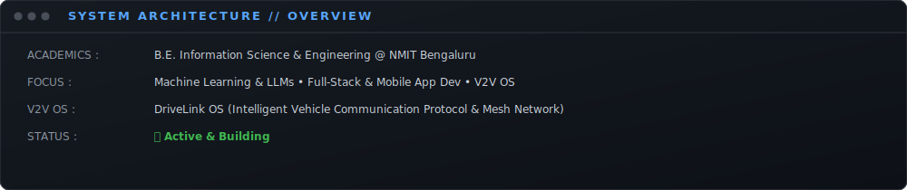
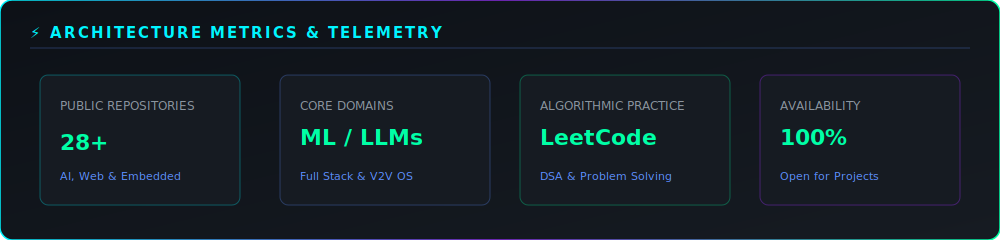

<div align="center">

<!-- HERO BANNER WITH GREEK TYPOGRAPHY, ML, LLM & APP DEV FOCUS -->


<br/>

<!-- ANIMATED TYPING HEADER -->
<a href="https://shreyas-rajashekar.vercel.app">
  
</a>

<br/>

<!-- QUICK NAVIGATION BADGES -->
<p align="center">
  <a href="https://shreyas-rajashekar.vercel.app"></a>
  <a href="https://github.com/shreyasrajshekar"></a>
  <a href="https://www.linkedin.com/in/shreyas-rajashekar-me/"></a>
  <a href="https://leetcode.com/u/shreyasrajshekar/"></a>
  <a href="mailto:shreyasrajashekar@gmail.com"></a>
</p>


</div>

<!-- NEAT MINIMALISTIC SYSTEM SVG -->
<div align="center">



<br/><br/>


</div>

## ⚡ TECH RADAR & ARCHITECTURE STACK

### 🧠 Machine Learning, LLMs & AI Systems
<p align="left">
  
  
  
</p>

### 📱 Full-Stack & App Development
<p align="left">
  
</p>

### 🔧 Backend, Databases & Infrastructure
<p align="left">
  
</p>

### 🔌 Hardware, Systems & IoT
<p align="left">
  
  
</p>

### 🛠️ Dev Tools & OS
<p align="left">
  
</p>

<br/>

### 📈 SKILL PROFICIENCY METRICS

```
PYTHON & ML        ████████████████████  92%  [PyTorch, LLM Orchestration, Scikit]
TYPESCRIPT / JS    ██████████████████░░  88%  [Full-Stack & App Development]
REACT / NEXT.JS    █████████████████░░░  85%  [Frontend Engineering]
NODE.JS / BACKEND  ████████████████░░░░  82%  [REST APIs & Microservices]
ARDUINO / IoT      ███████████████░░░░░  75%  [Embedded Sensors]
C++                ████████████░░░░░░░░  60%  [Systems & Microcontrollers]
RUST               ████████░░░░░░░░░░░░  40%  [Low-Level Systems Learning]
```

<br/>

<!-- NATIVE SVG TELEMETRY STATS CARD -->
<div align="center">
  
</div>

## 📊 TELEMETRY & STATS DASHBOARD

<div align="center">



</div>

<br/>

<!-- PHILOSOPHY & FOOTER -->
<div align="center">


### 💬 PHILOSOPHY

> *"CONNECTING MACHINES. BUILDING INTELLIGENCE. ENGINEERING THE FUTURE."*

<br/>

<!-- FOOTER ANIMATED SVG -->


<br/><br/>

<p align="center">
  <a href="#-shreyas-rajashekar-"><b>▲ BACK TO TOP ▲</b></a>
</p>

</div>
